# Creating an Ocean Cluster

### Prerequisites
- [Spot.io account attached to the AWS account within you created the EKS cluster](https://docs.spot.io/spotinst-video-tutorials/elastigroup/account-setup/)

## Ocean Overview

Ocean is Spot.io's Serverless Containers solution, after attaching a k8s cluster to Ocean, Ocean will make sure you always have the needed infrastructure based on your pods/deployments configurations.

> Note: While working with an auto-scaler it is highly important to specify requirements for your pods/deployments.

In order to attach your cluster to Ocean you'll have to create an Ocean cluster and install Spot.io kubernetes controller, the connection between the controller to the specific Ocean cluster will be based on a value called *cluster identifier*. This is a unique identifier that creates the connection between EKS and Ocean.

Whenever this controller will recognize any pending resources on top of your k8s cluster it'll make sure to scale up the cluster accordingly.

## Let's create an Ocean cluster

Go to your Spot.io Console and press the Cloud Clusters button on the left bar

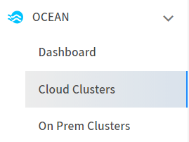

Then press the Create Cluster button

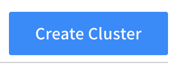

Next step would be to choose the "Join an Existing EKS Cluster option

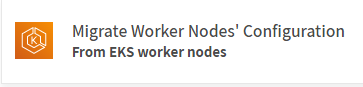

Fill up your cluster details 

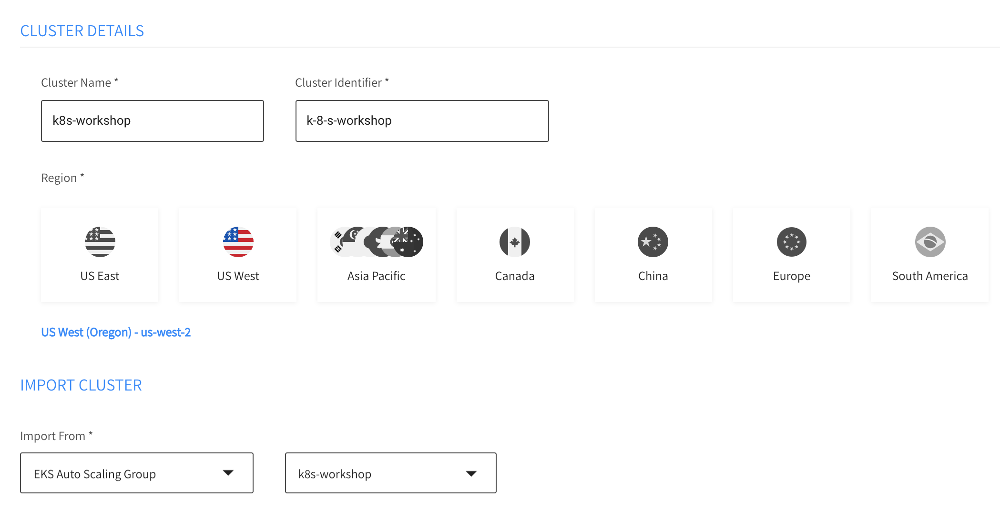

Press the Next button, all the configuration will be populated accordingly into the Compute section

By default Ocean is allowed to use all instance types and sizes, if you wish you can modify it by clicking the *Customize* button in the Machine types section

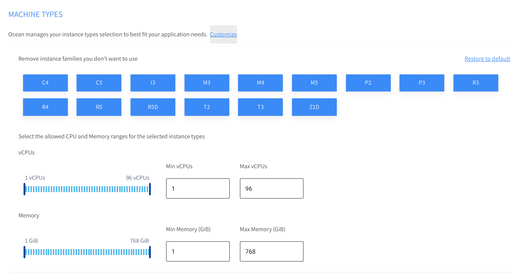

Go to the Resource Limits section and specify the overall resource Ocean will be allowed to launch on your behalf

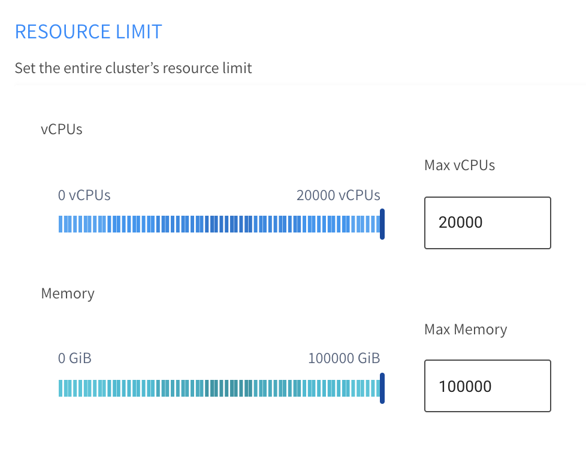

Press on the Additional Configurations in order to open this section, here you can specify weather you want your nodes to be associated with a public ip, register to a Load Balancer, the draining timeout (defaults to 5 minutes) and the root volume size

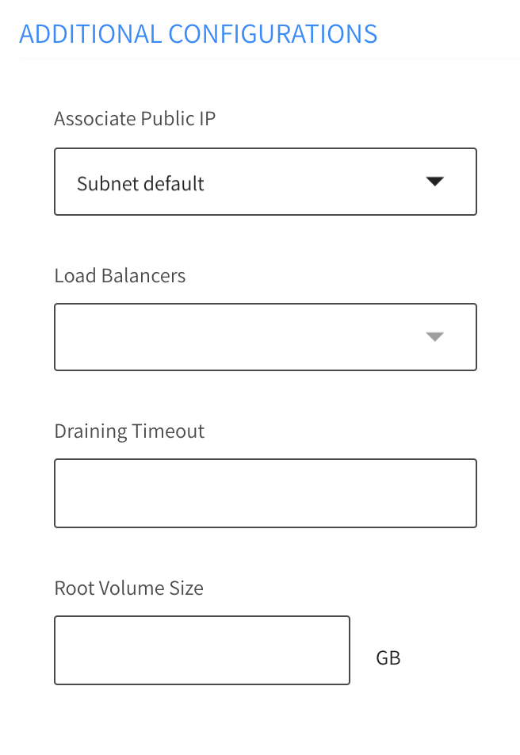

Press the Next button, then you'll reach the Connectivity page where you need to install the controller

## Installing the controller
Create a Spot.io Token (or use an existing one)

Copy the generated script from the UI
and run the script in your terminal
``` 
#!/usr/bin/env bash
curl -fsSL http://spotinst-public.s3.amazonaws.com/integrations/kubernetes/cluster-controller/scripts/init.sh | \
SPOTINST_TOKEN=<YOUR_TOKEN> \
SPOTINST_ACCOUNT=<YOUR_ACCOUNT> \
SPOTINST_CLUSTER_IDENTIFIER=<YOUR_CLUSTER_IDENTIFIER \
bash
```

After running the script, the required resources will be created on top of the cluster.

run and verify the Spot.io-kubernetes-cluster-controller is running
```
kubectl get pods -n kube-system 
```

The output should look like this

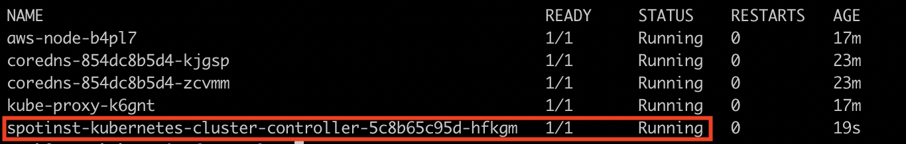

After about 2 minutes press the Test Connectivity button and it'll show that the connection has been established

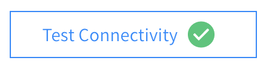

All we have to do now is to press the Next button, review the configuration, and create the cluster by pressing the Create button.

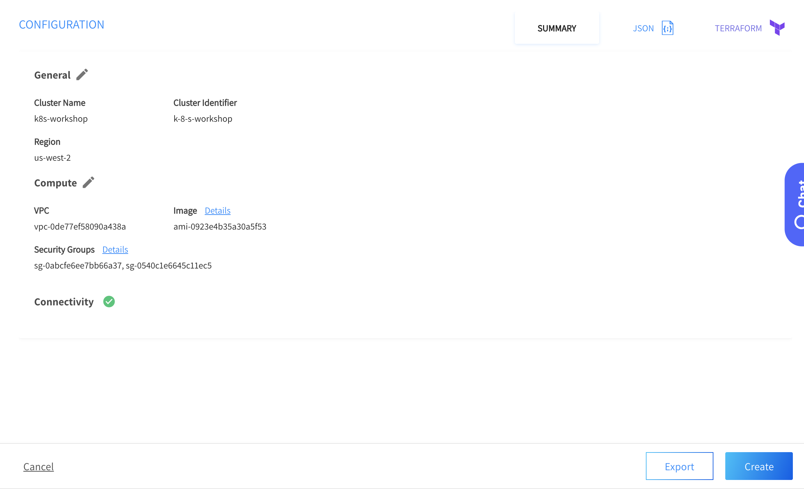

> Note: with EKS it is recommended to edit the values of the minimum & target capacity in the JSON configuration of the group to be at least 1

Congratulations, you have an up and running Ocean cluster, in a short while the instance launched by the Ocean cluster will register to the cluster

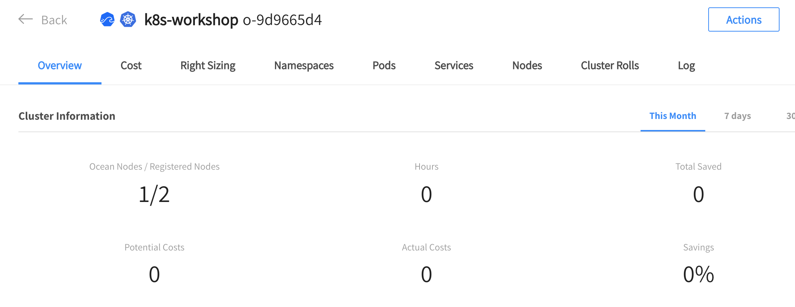

Once the cluster has been imported, we can migrate existing workloads. 