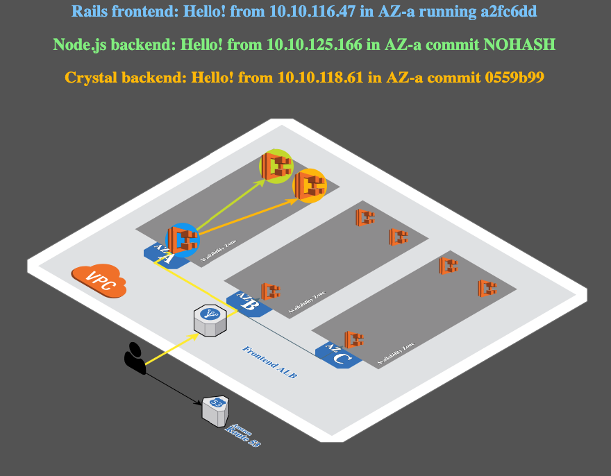

# Deploy application on K8s

In this section we will cover a deployment of sample application on K8s.

This application is taken from the ecsdemo on [GitHub](https://github.com/brentley?utf8=%E2%9C%93&tab=repositories&q=ecsde&type=&language=).

---

This is the output of the application which reflects its architecture:



Every request that comes from a LB that is connected to the `ecsdemo-frontend` service, will be routed to one of the different pods of the frontend tier. From there, the frontend will crate 2 requests from 2 different backend (crystal and nodejs).
The UI reflects which pods get traffic for the specific requests that came from the LB.

The application composed of the following K8s objects:

- [Deployment](https://kubernetes.io/docs/concepts/workloads/controllers/deployment/)
- [Service](https://kubernetes.io/docs/concepts/services-networking/service/)

## Deploying our Sample Application

For this demo we will use the AWS EKS workshop demo application.
This demo simulates frontend service with 2 backend services. The frontend is behind an ELB, while the backend services are being reached by K8s service mechanisem.

In order to run this demo make sure to clone the following git repo: https://github.com/spotinst/spotinst-workshop.

Run your terminal and reach the downloaded repo directory.

### NodeJS Backend API

Run the following commands in order to start the NodeJS backend API:

```
kubectl apply -f ./sample-app/nodejs/nodejs-backend.yaml
```

We can watch the progress by looking at the deployment status:

```
kubectl get deployment nodejs-backend -w
```

### Crystal Backend API

Next step would be to bring up the Crystal backened API:

```
kubectl apply -f ./sample-app/crystal/crystal-backend.yaml
```

We can watch the progress by looking at the deployment status:

```
kubectl get deployment crystal-backend -w
```

### Service types - intro

Service type determines how your service will be exposed for other to consume it.
You can read about K8s services on the [documentation](https://kubernetes.io/docs/concepts/services-networking/service/).

Lets cover the differences of the main service types:

- `ClusterIP` - That means that your service will only be accessable from whithin the cluster.
- `NodePort` - a port (random one, or one that is declared in your YAML file) will be open in every node on the cluster. That port will forwared request through the `ClusterIp` address to the desired pods.
- `LoadBalancer` - Supported only when running k8s on a Cloud provider. Will provision a LB on the cloud provider, forwarding traffic to a NodePort service that is being automaticly created.

---

### Ensure the ELB Service Exists

In AWS accounts that have never created a load balancer before, it’s possible that the service role for ELB might not exist yet.

We can check for the role, and create it if it’s missing.

Copy/Paste the following commands into your terminal:

```
aws iam get-role --role-name "AWSServiceRoleForElasticLoadBalancing" || aws iam create-service-linked-role --aws-service-name "elasticloadbalancing.amazonaws.com"
```

---

### Deploying Frontend application

Last part would be to deploy our frontend services:

```
kubectl apply -f ./sample-app/frontend/frontend.yaml
```

### Finding the Service Address

Now that we have a running service that is type: LoadBalancer we need to find the ELB’s address. We can do this by using the get services operation of kubectl:

```
kubectl get service frontend
```

Notice the field isn’t wide enough to show the FQDN of the ELB. We can adjust the output format with this command:

```
kubectl get service frontend -o wide
```

If we wanted to use the data programatically, we can also output via json. This is an example of how we might be able to make use of json output:

```
ELB=$(kubectl get service frontend -o json | jq -r '.status.loadBalancer.ingress[].hostname')

curl -m3 -v $ELB
```

> Tip: It will take several minutes for the ELB to become healthy and start passing traffic to the frontend pods.

You should also be able to copy/paste the loadBalancer hostname into your browser and see the application running. Keep this tab open while we scale the services up on the next page.
