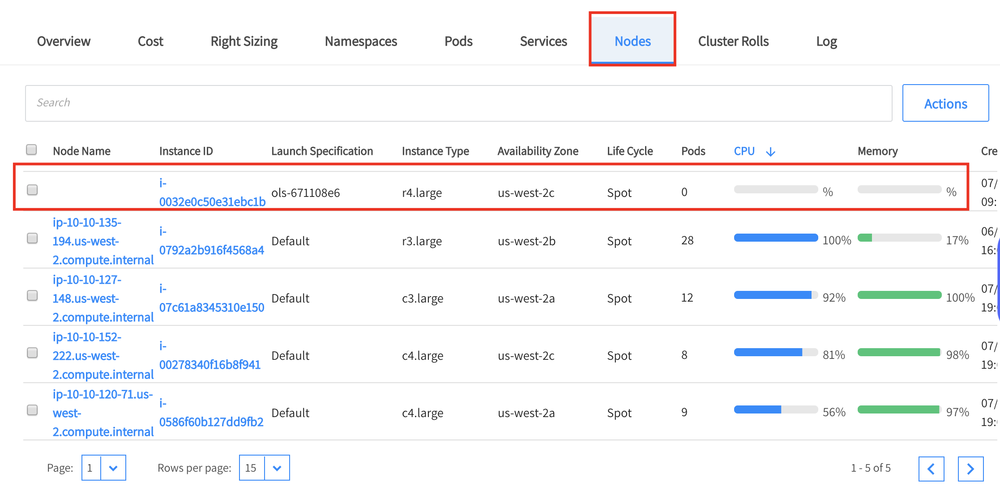
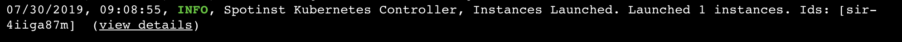
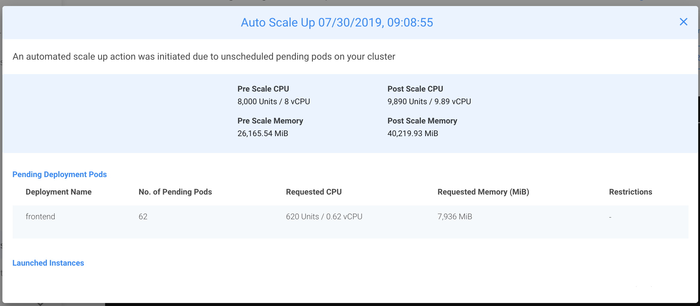

# Scaling with Ocean
In the first section we learned how to set an HPA, but there is still a missing piece of the puzzle, scaling up our deployments without taking care of the infrastructure really means nothing, isn't it?

Well, with Ocean you won't have to deal with it anymore, Ocean will recognize any pending resources and scale up accordingly

## Let's see that in action

Let's scale up one of our deployments

```kubectl edit deployment frontend```

This will open our deployment for editing, increase the number of replicas to 100, after a short, go to the Ocean cluster UI, click on the instances tab and you'll see new instances spawning in the cluster



After a shortwhile you'll be able to see a log showing the scaling event



If you'll click the view details link you'll see the following modal that shows the pre-scale and post-scale CPU & Memory and the resources that were launched in the cluster (pods & nodes)



## Scale down

Now let's delete this deployment

```kubectl delete deployment frontend```

Few minutes later, go back to the log tab and you'll see the scale-down events similar to the scale-up event.

## Headroom
Another important tool Ocean provides is called Headroom, headroom referes to keeping extra resources in order to allow mission critical pods to scheduled automatically without waiting for additonal resources to be launched

Headroom can be configured either as automatic or manually, automatic means that the autoscaler will use the mose frequent used pod in the cluster as the Headroom unit size, the amount of headroom units will consist of 5% of the cluster in this unit size

Headroom is built from 
* Numer of Units to keep
* CPU per unit
* Memory per unit
* GPU per unit

### Customize the headroom
On your Ocean cluster menu, press the Actions button, then choose Customize Scaling


A modal will open where you'll be able to modify the different attributes of your Headroom configurations


