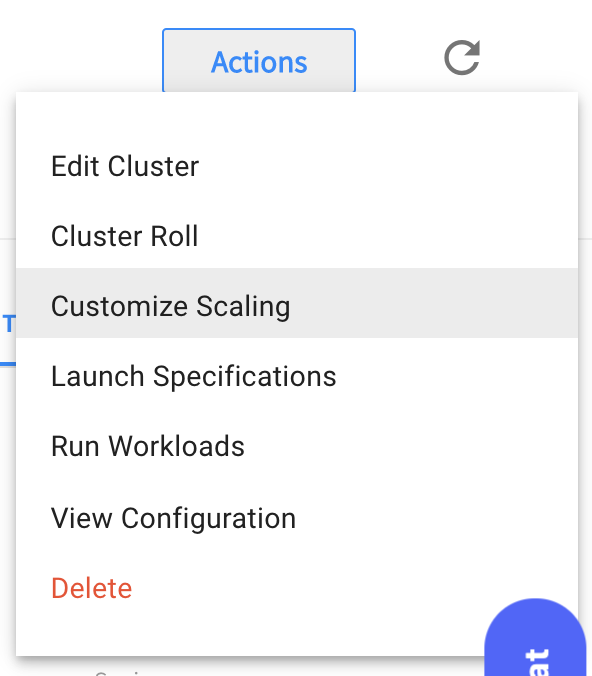
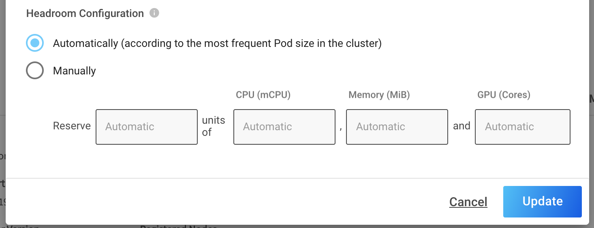

# Scaling with Ocean
In the first section we learned how to set an HPA, but there is still a missing piece of the puzzle, scaling up our deployments without taking care of the infrastructure really means nothing, isn't it?

Well, with Ocean you won't have to deal with it anymore, Ocean will recognize any pending resources and scale up accordingly

## Let's see that in action

## Headroom
Another important tool Ocean provides is called Headroom, headroom referes to keeping extra resources in order to allow mission critical pods to scheduled automatically without waiting for additonal resources to be launched

Headroom can be configured either as automatic or manually, automatic means that the autoscaler will use the mose frequent used pod in the cluster as the Headroom unit size, the amount of headroom units will consist of 5% of the cluster in this unit size

Headroom is built from 
* Numer of Units to keep
* CPU per unit
* Memory per unit
* GPU per unit

### Let's customize our headroom
On your Ocean cluster menu, press the Actions button, then choose Customize Scaling

A modal will open where you'll be able to modify the different attributes of your Headroom configurations

