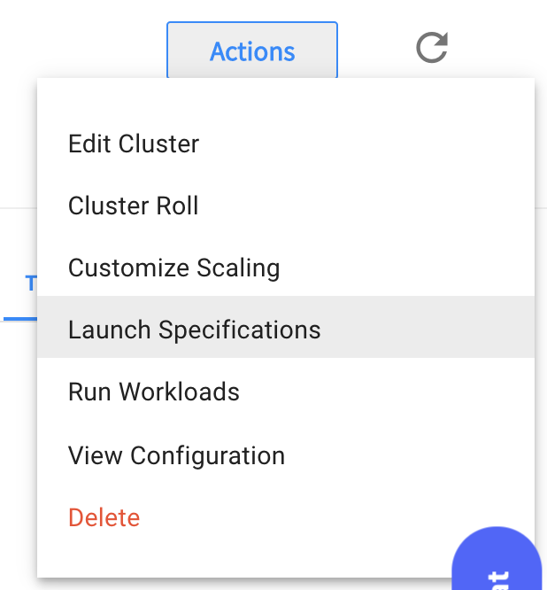
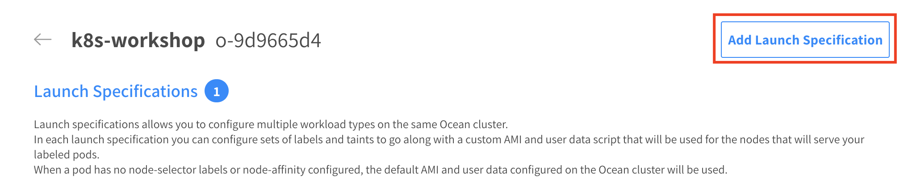
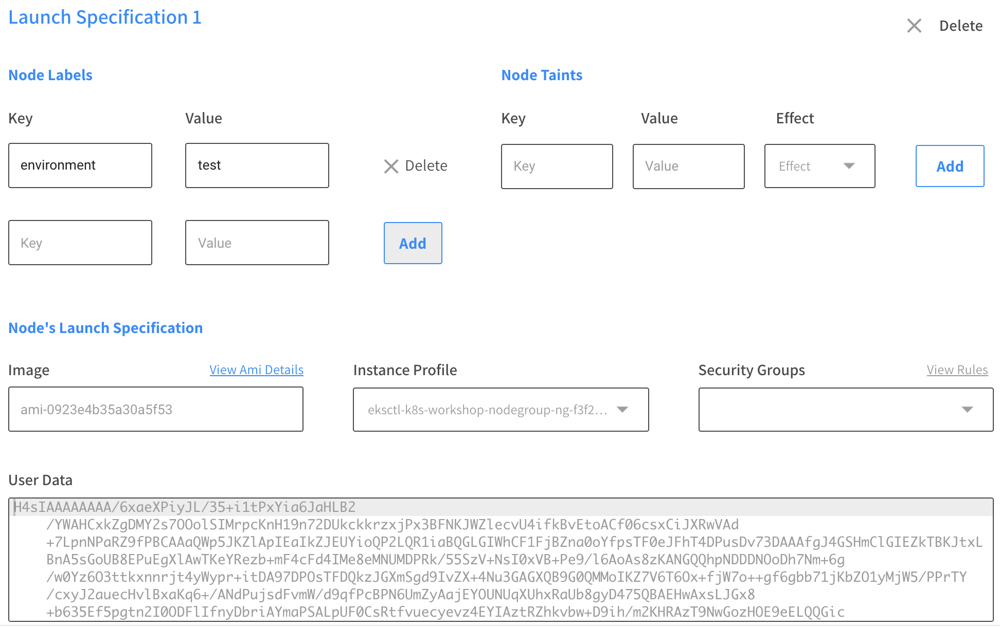

# Custom Launch Specifications

Launch specifications allow you to configure multiple workload types on the same ocean cluster.
With Ocean launch specs you can configure sets of labels and taints to go along with a custom AMI and user data script that will be used for the nodes that will serve your labeled pods.

## Creating a custom Launch Spec
Go to your Ocean cluster UI

Press the "Actions" button on the top right of the screen, choose "Launch Specifications"



Press "Add Launch Speceficiation"



A new launch specification section will be created, add the following Node Labels: 

> key: environment, value: test



After creating the Launch Spec be sure to press the "Update" button.

## Testing it out
In this case we will run a deployment that has the following nodeSelector label:
environment: test

Behind the scenes Spotinst Ocean Autoscaler will launch an instance from the specified Launch Spec

Run the following command from your terminal:
```
kubectl apply -f ./scheduling-examples/custom-launch-spec.yaml
```
